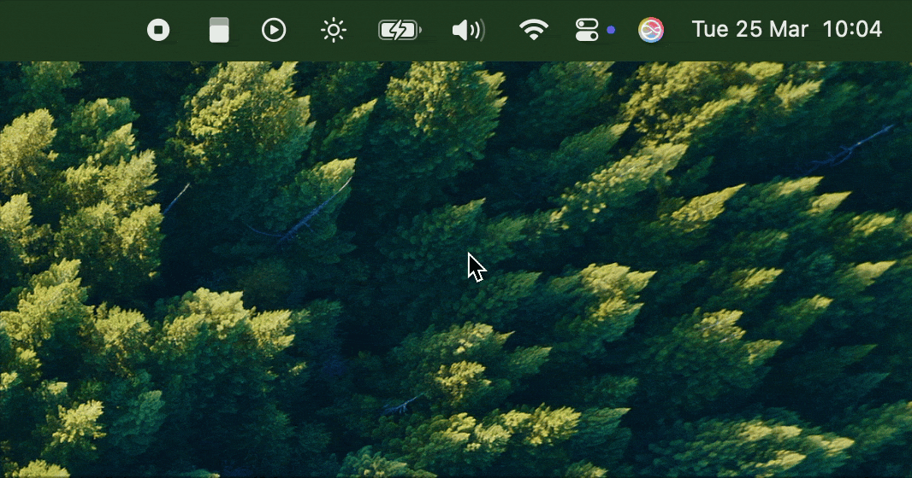

# Memcard

  

A desktop application designed to help you learn and memorize information effectively using spaced repetition and flashcard techniques.

## Features

### Key Features:

- Automatic vocabulary reminders based on customized schedules
- Ability to pause or resume reminders as needed

  

### Upcoming Features:

- Spaced repetition system based on learner feedback
- Support for external flashcard decks
- Multi-language support
- Windows and Linux compatibility

## Author

- Nguyễn Lê Hoàng Tuấn (nguyentuanit96@gmail.com) 